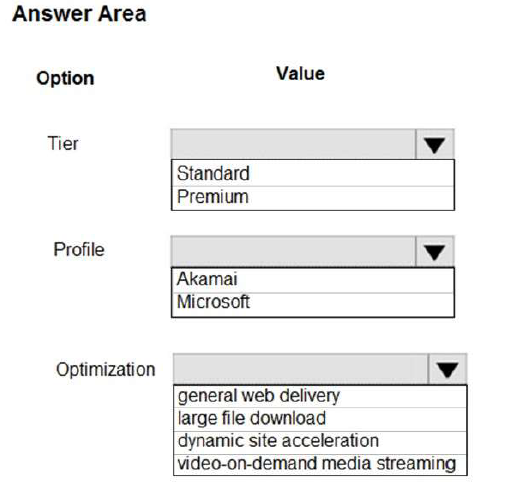
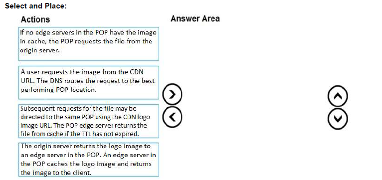
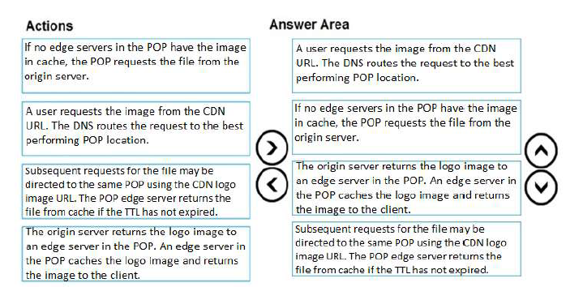
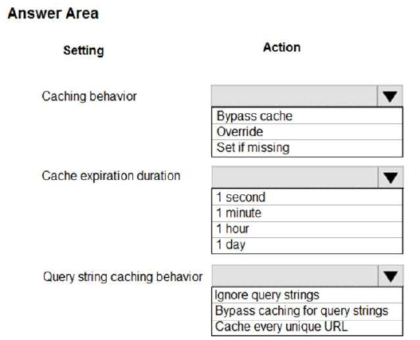
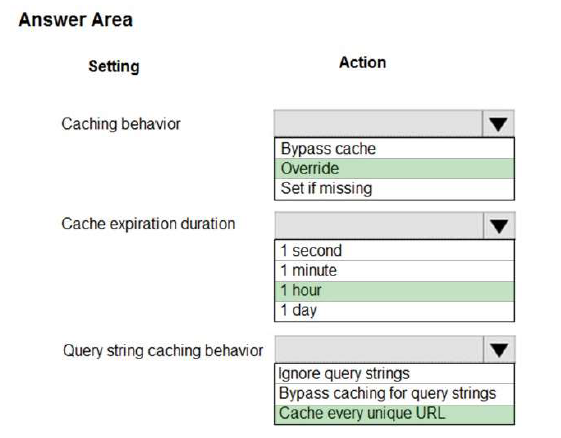

# Tema 1: Azure CDN (Content Delivery Network)

### Preguntas:

- ¿Qué es Azure CDN y cuál es su propósito en el despliegue de aplicaciones web?

  

  Un CDN (Content Delivery Network, por sus siglas en inglés) o red de entrega de contenido es una red de servidores interconectados ubicados en diferentes lugares geográficos en todo el mundo. Su propósito principal es acelerar la entrega de contenido web, como páginas, imágenes, videos y otros archivos, a los usuarios finales.

  El funcionamiento de un CDN se basa en el almacenamiento en caché, que consiste en guardar copias del contenido en servidores distribuidos estratégicamente en diversos puntos de presencia (PoP) alrededor del mundo. Cuando un usuario solicita acceder a un sitio web, el CDN redirige esa solicitud al servidor más cercano geográficamente al usuario, lo que reduce la distancia física y, por lo tanto, el tiempo de respuesta. Esto permite una carga más rápida de los recursos del sitio web y una mejor experiencia para el usuario.

  Los principales propósitos de un CDN son:

  - Mejorar la velocidad de carga
  - Reducir la carga del servidor
  - Mitigar problemas de ancho de banda
  - Mejorar la seguridad

  

- ¿Cuáles son los beneficios de utilizar Azure CDN en términos de rendimiento y
  escalabilidad?

  Al utilizar Azure CDN, se obtienen varios beneficios en términos de rendimiento y escalabilidad :

  Beneficios:

  • Mejor rendimiento y mejor experiencia del usuario para los usuarios finales.

  • Escalabilidad para manejar cargas altas instantáneas de manera más eficiente

  • Distribución de las solicitudes de los usuarios y entrega de contenido directamente desde los servidores periféricos, lo que reduce el tráfico enviado al servidor de origen.

  En resumen, utilizar Azure CDN tiene varios beneficios, como un mejor rendimiento, una mayor escalabilidad y una distribución eficiente de las solicitudes y el contenido. Estos beneficios contribuyen a brindar una experiencia más satisfactoria a los usuarios finales y a optimizar el funcionamiento de un sitio web o aplicación móvil.

  

- ¿Cómo se configura y se utiliza Azure CDN para acelerar la entrega de contenido estático
  y dinámico en una aplicación web?

  Para configurar y utilizar Azure CDN para acelerar la entrega de contenido estático y dinámico en una aplicación web, se siguen los siguientes pasos:

  ​	1.Crear un punto de conexión de CDN

  ​	2.Configurar reglas de caché

  ​	3.Optimizar la entrega de contenido estático

  ​	4.Optimizar la entrega de contenido dinámico

  ​	5.Monitorear y ajustar el rendimiento

  En resumen, para configurar y utilizar Azure CDN para acelerar la entrega de contenido estático y dinámico en una aplicación web, se crea un punto de conexión de CDN, se configuran reglas de caché, se optimiza la entrega de contenido estático y dinámico, y se monitorea y ajusta el rendimiento según sea necesario. Al aprovechar la infraestructura de distribución global de Azure CDN, se logra una entrega más rápida y eficiente del contenido a los usuarios finales, mejorando la experiencia de uso de la aplicación web.

  

  

  -------------------------------------------------------------------------------------------------------------------------------------------------------------------------------------------

  

  

  
  
  

  ### Identificar y explicar (comprobar si es posible) de la bateria de Preguntas 3 preguntas por cada integrante relacionadas con Azure CDN

  

  **TESTLET 1 - CASE STUDY - PAGINA 4**
  
  **QUESTION 1** 

  HOTSPOT
  You need to configure Azure CDN for the Shipping web site.
  Which configuration options should you use? To answer, select the appropriate options in the answer area:

  

  

  Las opciones correctas son:
  
  - Tier --> **Standard**
  - Profile --> **Akamai**
  - Optimization --> **dynamic site acceleration**
  
  **Explicacion**:
  
  Utiliza Azure Content Delivery Network (CDN) y asegura un rendimiento máximo para el contenido dinámico mientras se minimiza la latencia y los costos.
  
  La aceleración de sitios dinámicos (DSA) está disponible para los perfiles de Azure CDN Standard de Akamai, Azure CDN Standard de Verizon y Azure CDN Premium de Verizon.
  
  DSA incluye diversas técnicas que benefician la latencia y el rendimiento del contenido dinámico. Estas técnicas incluyen optimización de rutas y redes, optimización de TCP y más.
  
  Puedes utilizar esta optimización para acelerar una aplicación web que incluya numerosas respuestas que no se puedan almacenar en caché. Algunos ejemplos son los resultados de búsqueda, las transacciones de pago o los datos en tiempo real. Puedes seguir utilizando las capacidades básicas de almacenamiento en caché de Azure CDN para los datos estáticos.
  
  
  
  
  
  -------------------------------------------------------------------------------------------------------------------------------------------------------------------------------------------

**DEVELOP FOR AZURE STORAGE - QUESTION SET 4 - PAGINA 88**

**QUESTION 6**

DRAG DROP
Your company has several websites that use a company logo image. You use Azure Content Delivery
Network (CDN) to store the static image.
You need to determine the correct process of how the CDN and the Point of Presence (POP) server will
distribute the image and list the items in the correct order.
In which order do the actions occur? To answer, move all actions from the list of actions to the answer area
and arrange them in the correct order.

El orden correcto de las acciones es:

**Explicacion:**

Paso 1: Un usuario solicita la imagen. Un usuario solicita un archivo (también llamado recurso) utilizando una URL con un nombre de dominio especial, como <nombre de punto de conexión>.azureedge.net. Este nombre puede ser un nombre de host de punto de conexión o un dominio personalizado. El DNS dirige la solicitud hacia la ubicación de POP (Punto de Presencia) que ofrece el mejor rendimiento, que generalmente es el POP geográficamente más cercano al usuario.

Paso 2: Si no hay servidores de borde en el POP que tengan el archivo... Si no hay servidores de borde en el POP que tengan el archivo en su caché, el POP solicita el archivo al servidor de origen. El servidor de origen puede ser una aplicación web de Azure, un servicio en la nube de Azure, una cuenta de almacenamiento de Azure o cualquier servidor web accesible públicamente.

Paso 3: El servidor de origen devuelve el archivo... El servidor de origen devuelve el archivo a un servidor de borde en el POP. Un servidor de borde en el POP almacena en caché el archivo y lo devuelve al solicitante original (Alice). El archivo permanece en caché en el servidor de borde en el POP hasta que expire el tiempo de vida (TTL) especificado en sus encabezados HTTP. Si el servidor de origen no especificó un TTL, el TTL predeterminado es de siete días.

Paso 4: Solicitudes posteriores... Usuarios adicionales pueden solicitar el mismo archivo utilizando la misma URL que el usuario original utilizó, y también pueden dirigirse al mismo POP. Si el TTL del archivo no ha expirado, el servidor de borde en el POP devuelve el archivo directamente desde la caché. Este proceso resulta en una experiencia de usuario más rápida y receptiva.

-------------------------------------------------------------------------------------------------------------------------------------------------------------------------------------------

**MONITOR, TROUBLESHOOT, AND OPTIMIZE AZURE SOLUTIONS - QUESTION SET 5 - PAGINA 199**

**QUESTION 8**

HOTSPOT
You are developing an Azure App Service hosted ASP.NET Core web app to deliver video-on-demand
streaming media. You enable an Azure Content Delivery Network (CDN) Standard for the web endpoint.
Customer videos are downloaded from the web app by using the following example URL: http://
www.contoso.com/content.mp4?quality=1
All media content must expire from the cache after one hour. Customer videos with varying quality must be
delivered to the closest regional point of presence (POP) node.
You need to configure Azure CDN caching rules.
Which options should you use? To answer, select the appropriate options in the answer area.

Las opciones correctas son las siguientes:

**Explicacion:**

Box 1: Override Override: Ignora la duración de caché proporcionada por el origen y utiliza en su lugar la duración de caché proporcionada. Esto no anula la directiva de caché "cache-control: no-cache". Establecer si falta: Respeta las directivas de caché proporcionadas por el origen, si existen; de lo contrario, utiliza la duración de caché proporcionada.

Box 2: 1 hora Todo el contenido multimedia debe expirar de la caché después de una hora.

Box 3: Caché de cada URL único Caché de cada URL único: En este modo, cada solicitud con una URL única, incluyendo la cadena de consulta, se trata como un recurso único con su propia caché. Por ejemplo, la respuesta del servidor de origen para una solicitud de ejemplo.ashx?q=test1 se almacena en la ubicación POP y se devuelve para posteriores solicitudes con la misma cadena de consulta. Una solicitud de ejemplo.ashx?q=test2 se almacena en caché como un recurso separado con su propia configuración de tiempo de vida (time-to-live).