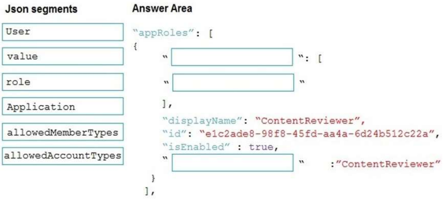
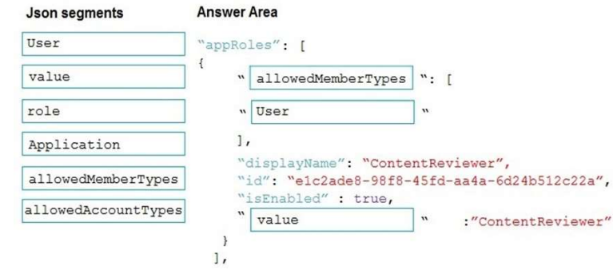
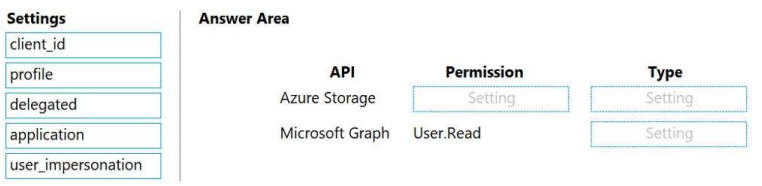
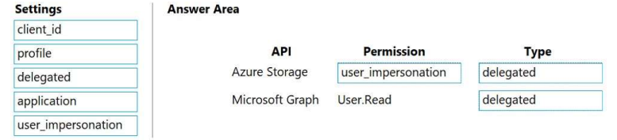
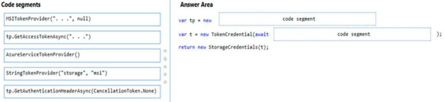
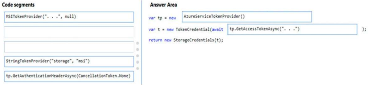

## Tema 3: Implement user authentication and authorization

- Preguntas: 
  - **¿Qué es la Plataforma de Identidad de Microsoft y cómo se utiliza para la autenticación de usuarios?** 
  
    La Plataforma de Identidad de Microsoft Azure es un conjunto de servicios y herramientas que facilitan la autenticación y gestión de identidades en aplicaciones y servicios en la nube. Con servicios como Azure Active Directory, Azure AD B2C y Azure AD Connect, los desarrolladores pueden agregar funciones de inicio de sesión seguro y administración de identidades en sus aplicaciones. Estos servicios se integran mediante APIs y SDKs, permitiendo solicitar tokens de acceso, autenticar usuarios y proteger recursos de manera segura. En resumen, la plataforma de identidad de Azure proporciona una solución completa para implementar la autenticación de usuarios de manera segura en aplicaciones y servicios en la nube.
  
  - **¿Cuál es el flujo de autenticación más común al utilizar la Plataforma de Identidad de Microsoft?** 
  
    El flujo de autenticación más común al utilizar la Plataforma de Identidad de Microsoft Azure comienza con el usuario ingresando sus credenciales en una aplicación que utiliza Azure AD o Azure AD B2C como proveedor de identidad. El proveedor de identidad verifica las credenciales, emite un token de acceso y redirige al usuario de vuelta a la aplicación. La aplicación valida el token de acceso y, una vez confirmado, permite al usuario acceder a los recursos protegidos. Este flujo garantiza la autenticación segura del usuario y la protección de los recursos en aplicaciones y servicios basados en Azure.
  
  - **¿Cómo se obtienen y se utilizan los tokens de acceso para autorizar solicitudes a recursos protegidos?**
  
    Para obtener y utilizar los tokens de acceso en la Plataforma de Identidad de Microsoft Azure para autorizar solicitudes a recursos protegidos, el usuario se autentica a través del proveedor de identidad, como Azure AD. El proveedor de identidad emite un token de acceso que contiene información sobre la identidad del usuario y sus permisos. El token de acceso se envía a la aplicación, que lo valida verificando su firma y fecha de expiración. Una vez validado, la aplicación utiliza la información del token para autorizar las solicitudes del usuario a los recursos protegidos, asegurando que el usuario tenga los permisos adecuados. De esta manera, los tokens de acceso desempeñan un papel crucial en la autorización segura de las solicitudes a los recursos protegidos en la Plataforma de Identidad de Azure.
  
- Identificar y explicar (comprobar si es posible) de la bateria de Preguntas 3 preguntas por cada integrante relacionadas con user authentication and authorization . 

  - **QUESTION 1, PÁGINA 110:** 

    **DRAG DROP** 

    **You need to add markup at line AM04 to implement the ContentReview role. How should you complete the markup? To answer, drag the appropriate json segments to the correct locations. Each json segment may be used once, more than once, or not at all. You may need to drag the split bar between panes or scroll to view content.** 

    NOTE: Each correct selection is worth one point.

    Select and Place:

    

    Respuesta correcta:

    

    **Explicación:** 

    Recuadro 1: allowedMemberTypes 

    allowedMemberTypes especifica si esta definición de rol de la aplicación se puede asignar a usuarios y grupos configurando como "User", a otras aplicaciones (que acceden a esta aplicación en escenarios de servicio daemon) configurando como "Application", o a ambos. 

    Recuadro 2: User 

    Escenario: Para revisar contenido, un usuario debe formar parte de un rol ContentReviewer.

    Recuadro 3: value 

    "Value" especifica el valor que se incluirá en la afirmación de roles en los tokens de autenticación y acceso. 

  - **QUESTION 19, PÁGINA 157:**

    **DRAG DROP** 

    **You are developing an ASP.NET Core website that can be used to manage photographs which are stored in Azure Blob Storage containers.** 

    **Users of the website authenticate by using their Azure Active Directory (Azure AD) credentials.** 

    **You implement role-based access control (RBAC) role permissions on the containers that store photographs. You assign users to RBAC roles.** 

    **You need to configure the website’s Azure AD Application so that user’s permissions can be used with the Azure Blob containers.** 

    **How should you configure the application? To answer, drag the appropriate setting to the correct location. Each setting can be used once, more than once, or not at all. You may need to drag the split bar between panes or scroll to view content.** 

    NOTE: 

    Each correct selection is worth one point. 

    Select and Place:

    

    Respuesta correcta:

    

    **Explicación:** 

    Recuadro 1: user_impersonation 

    Recuadro 2: delegated 

    Ejemplo:

    - Selecciona la sección de permisos de API.
- Haz clic en el botón Agregar permiso y luego: asegúrate de que la pestaña My APIs esté seleccionada.
    - En la lista de APIs, selecciona la API TodoListService-aspnetcore.
- En la sección de permisos delegados, asegúrate de que los permisos correctos estén marcados: user_impersonation.
    - Selecciona el botón Agregar permisos.

    Recuadro 3: delegated 
  
    Ejemplo:
  
    - Selecciona la sección de permisos de API.
- Haz clic en el botón Agregar permiso y luego: asegúrate de que la pestaña Microsoft APIs esté seleccionada.
    - En la sección de "APIs de Microsoft comúnmente utilizadas", haz clic en "Microsoft Graph".
- En la sección de permisos delegados, asegúrate de que los permisos correctos estén marcados: User.Read. Utilize el cajón de búsqueda si es necesario.
    - Selecciona el botón Agregar permisos.

  - **QUESTION 1, PÁGINA 78:**

    **DRAG DROP** 

    **You need to add code at line PC32 in Processing.cs to implement the GetCredentials method in the Processing class.** 

    **How should you complete the code? To answer, drag the appropriate code segments to the correct locations. Each code segment may be used once, more than once, or not at all. You may need to drag the split bar between panes or scroll to view content.** 

    NOTE: Each correct selection is worth one point. 

    Select and Place:

    

    Respuesta correcta:

    

    **Explicación:**

    Recuadro 1: AzureServiceTokenProvider() 

    Recuadro 2: tp.GetAccessTokenAsync("..") 

    Adquirir un token de acceso es fácil. Código de ejemplo: 

    private async Task GetAccessTokenAsync() 

    { 

    ​	var tokenProvider = new AzureServiceTokenProvider(); 
  
    ​	return await tokenProvider.GetAccessTokenAsync("https://storage.azure.com/"); 
  
    } 
