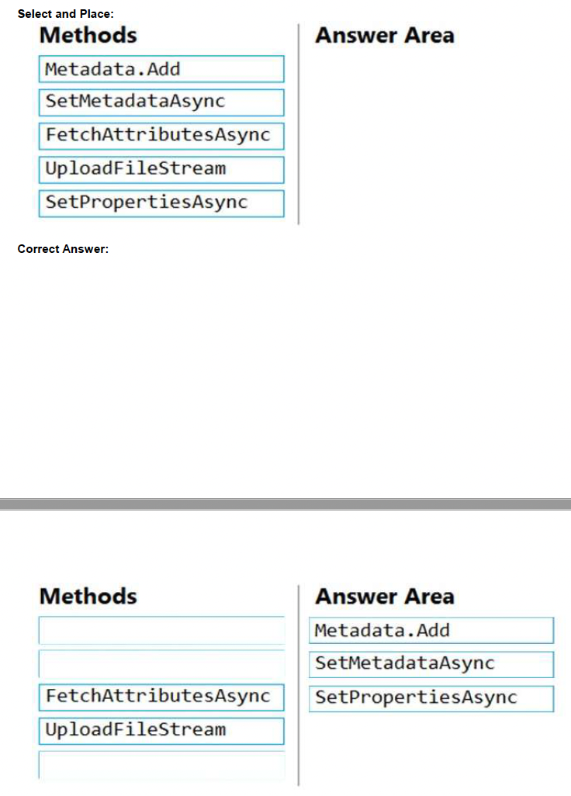

## Tema 4: Develop solutions that use Cosmos DB storage

- Preguntas: 

  

- **¿Qué es Azure Blob storage y cómo se utiliza para almacenar datos no estructurados?**

  Azure Blob storage es un servicio de almacenamiento en la nube ofrecido por Microsoft Azure. Proporciona un sistema escalable y duradero para almacenar grandes cantidades de datos no estructurados, como imágenes, videos, archivos de audio, documentos, registros y cualquier otro tipo de contenido binario o de texto.

  Blob storage organiza los datos en contenedores, que son unidades lógicas de almacenamiento. Cada contenedor puede contener cualquier número de blobs (Binary Large Objects, Objetos Binarios Grandes), que son los elementos individuales de datos. Los blobs se pueden acceder y gestionar mediante una interfaz de programación de aplicaciones (API) proporcionada por Azure Blob storage.

  - **¿Cuáles son los tipos de blobs que se pueden almacenar en Azure Blob storage?**

Existen tres tipos de blobs en Azure Blob storage:

1. Blob de bloque: es la opción más adecuada para almacenar archivos grandes, como videos o archivos de imágenes. Los blobs de bloque se dividen en bloques más pequeños y se almacenan de manera eficiente. Además, se pueden realizar operaciones de escritura en bloques individuales sin tener que cargar el archivo completo.
2. Blob de página: este tipo de blob se utiliza para almacenar datos estructurados, como bases de datos virtuales o discos duros virtuales. Los blobs de página admiten operaciones de lectura y escritura a nivel de página, lo que permite acceder a fragmentos de datos específicos dentro del blob.
3. Blob de apéndice: es útil para escenarios en los que se requiere agregar datos al final de un archivo sin modificar el contenido existente. Los blobs de apéndice permiten agregar nuevos datos al final del blob sin tener que reescribir o cargar todo el archivo nuevamente.

Para utilizar Azure Blob storage, es necesario crear una cuenta de almacenamiento en Azure y luego acceder a ella a través de la API proporcionada por Microsoft o mediante una de las bibliotecas de cliente disponibles en varios lenguajes de programación. Estas bibliotecas facilitan la interacción con el servicio de almacenamiento y permiten subir, descargar, eliminar y administrar blobs y contenedores.

Además, Azure Blob storage proporciona características adicionales, como la capacidad de almacenar metadatos personalizados con los blobs, configurar permisos de acceso a nivel de blob o contenedor, habilitar la replicación geográfica para mayor durabilidad y disponibilidad, y usar características de almacenamiento en caliente o almacenamiento en frío para optimizar costos según las necesidades de acceso a los datos.

En resumen, Azure Blob storage es un servicio flexible y escalable para almacenar datos no estructurados en la nube de Azure, ofreciendo una variedad de características y opciones de almacenamiento adaptadas a diferentes casos de uso.

**¿Cómo se accede y se administra el almacenamiento de blobs en Azure?**

El almacenamiento de blobs en Azure se puede acceder y administrar a través de varias opciones, como las siguientes:

1. Azure Portal: El portal de Azure proporciona una interfaz gráfica de usuario (GUI) para administrar el almacenamiento de blobs. Puedes crear contenedores, cargar, descargar y eliminar blobs, establecer permisos de acceso y ver métricas y registros de almacenamiento.
2. Azure Storage Explorer: Es una herramienta independiente y gratuita que facilita la administración y exploración de almacenamiento en Azure. Permite acceder a las cuentas de almacenamiento, explorar contenedores y blobs, cargar y descargar archivos, y administrar permisos y metadatos.
3. Azure PowerShell: Puedes utilizar los cmdlets de PowerShell de Azure para interactuar con el almacenamiento de blobs. Estos cmdlets permiten automatizar tareas y realizar operaciones como crear contenedores, subir y descargar blobs, establecer permisos y configurar características de almacenamiento.
4. Azure CLI: La interfaz de línea de comandos de Azure (CLI) también proporciona comandos para administrar el almacenamiento de blobs. Puedes utilizar la CLI para crear contenedores, cargar y descargar blobs, establecer permisos y gestionar características de almacenamiento.
5. API de REST de Azure Blob storage: Azure Blob storage ofrece una API REST que permite interactuar con el almacenamiento de blobs mediante solicitudes HTTP. Puedes utilizar esta API directamente o a través de bibliotecas de cliente en varios lenguajes de programación para realizar operaciones de almacenamiento, como subir, descargar y eliminar blobs, administrar contenedores y establecer permisos.

Además de estas opciones, también hay bibliotecas de cliente disponibles para varios lenguajes de programación, como .NET, Java, Python y JavaScript. Estas bibliotecas proporcionan abstracciones de alto nivel y facilitan la interacción con Azure Blob storage, permitiendo realizar operaciones comunes de manera más sencilla.

Al utilizar estas herramientas y opciones de administración, podrás acceder y gestionar el almacenamiento de blobs en Azure de manera eficiente y adaptada a tus necesidades específicas.

**Pregunta 10,página 31:** 

Desarrollas un software como servicio (SaaS) para gestionar fotografías. Los usuarios cargan fotos en un servicio web que luego almacena las fotos en Azure Storage Blob storage. El tipo de cuenta de almacenamiento es General-purpose V2. 

Cuando se cargan las fotos, deben procesarse para producir y guardar una versión compatible con dispositivos móviles de la imagen. El proceso para producir una versión compatible con dispositivos móviles de la imagen debe iniciarse en menos de un minuto.

 Necesitas diseñar el proceso que inicie el procesamiento de fotos. 

 **Solución:** Convertir la cuenta de almacenamiento de Azure a una cuenta de almacenamiento BlockBlobStorage. 

**¿Cumple la solución con el objetivo? **

A. Sí 

B. No 

Respuesta correcta: B 

Explicación No es necesario convertir la cuenta, en su lugar, mueve el procesamiento de fotos a una función de Azure que se active desde la carga del blob. Los eventos de Azure Storage permiten que las aplicaciones reaccionen a los eventos. Escenarios comunes de eventos de Blob storage incluyen el procesamiento de imágenes o videos, la indexación de búsqueda o cualquier flujo de trabajo orientado a archivos. Nota: Solo las cuentas de almacenamiento de tipo StorageV2 (general purpose v2) y BlobStorage admiten la integración de eventos. El almacenamiento (general purpose v1) no admite la integración con Event Grid. 

Referencia: https://docs.microsoft.com/en-us/azure/storage/blobs/storage-blob-event-overview

**Pregunta 22,página 46:**

Estás desarrollando una aplicación que utiliza Azure Blob storage.

La aplicación debe leer los registros de transacciones de todos los cambios que ocurran en los blobs y los metadatos de los blobs en la cuenta de almacenamiento con fines de auditoría. Los cambios deben estar en el orden en que ocurrieron, incluir solo operaciones de creación, actualización, eliminación y copia, y deben conservarse por razones de cumplimiento.

Necesitas procesar los registros de transacciones de forma asíncrona.

**¿Qué debes hacer?**

A. Procesar todos los eventos de Azure Blob storage utilizando Azure Event Grid con una aplicación de función de Azure como suscriptor.

B. Habilitar el registro de cambios (change feed) en la cuenta de almacenamiento y procesar todos los cambios para los eventos disponibles.

C. Procesar todos los registros de análisis de almacenamiento de Azure para eventos exitosos de blobs.

D. Utilizar la API de recolector de datos HTTP de Azure Monitor y escanear el cuerpo de la solicitud en busca de eventos exitosos de blobs.

**Respuesta correcta: B**

Explicación:

Soporte para registro de cambios (change feed) en Azure Blob Storage

El propósito del registro de cambios es proporcionar registros de transacciones de todos los cambios que ocurran en los blobs y los metadatos de los blobs en tu cuenta de almacenamiento. El registro de cambios proporciona un registro ordenado, garantizado, duradero, inmutable y de solo lectura de estos cambios. Las aplicaciones de cliente pueden leer estos registros en cualquier momento, ya sea en modo de transmisión o en modo por lotes. El registro de cambios te permite construir soluciones eficientes y escalables que procesan los eventos de cambio que ocurren en tu cuenta de Blob Storage a un costo bajo.

Referencia:

https://docs.microsoft.com/en-us/azure/storage/blobs/storage-blob-change-feed

**Pregunta 14, página 103:**

Tienes una aplicación que utiliza Azure Blob storage. Necesitas actualizar los metadatos de los blobs. ¿Qué tres métodos deberías usar para desarrollar la solución? Para responder, mueve los métodos apropiados desde la lista de métodos hacia el área de respuesta y organízalos en el orden correcto.

 Explicación:

 Ejemplo de Metadata.Add: 

// Agregar metadatos al diccionario llamando al método Add metadata.Add("docType", "textDocuments"); 

Ejemplo de SetMetadataAsync: 

// Establecer los metadatos del blob.

await blob.SetMetadataAsync(metadata);

 // Establecer las propiedades del blob. 

await blob.SetPropertiesAsync(); 

Referencia: https://docs.microsoft.com/en-us/azure/storage/blobs/storage-blob-properties-metadata
